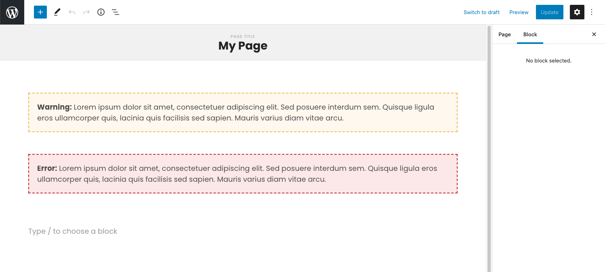
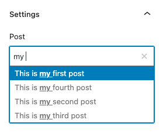
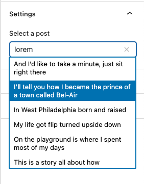
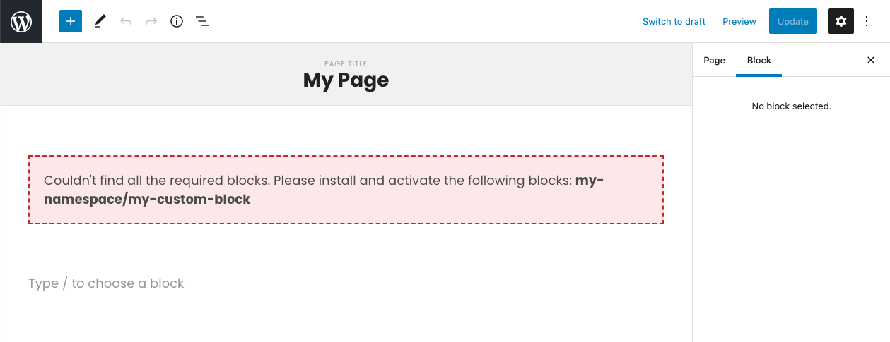
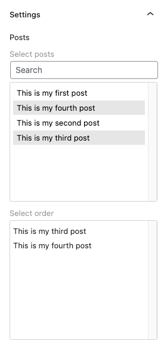
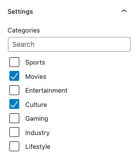

# WordPress Block Toolkit

A collection of tools for WordPress Gutenberg block building.

## Styles

To include the editor styles, add this to the top of your block's `_editor.scss`:

`@import "~@evermade/wp-block-toolkit/build/index.css";`

## Components

### InlineNotice

Compliments the base WordPress notice system by allowing you to show either warning or error level notices inside the editor.



```javascript
<InlineNotice status="error">
	<strong>Error: </strong> Lorem ipsum dolor sit amet.
</InlineNotice>
```

### PostControl

Custom ComboboxControl for selecting a single post. Takes an array of post objects and returns and id number on change.



```javascript
<PostControl
	label="My Label"
	value={mySelectedPostId}
	posts={myPosts}
	onChange={(value) =>
		setAttributes({
			mySelectedPostId: value,
		})
	}
/>
```

### PostSearchControl

For selecting a single post from a large pool of posts. More performant than `PostControl` at the cost of requiring additional user input.



```javascript
<PostSearchControl
	label="My label"
	placeholder="My placeholder"
	value={mySelectedPostId}
	onChange={(value) =>
		setAttributes({
			mySelectedPostId: value,
		})
	}
	inputProps={{
		autoFocus: true
	}}
/>
```

### RequireBlocks

Allows you to only show components if certain blocks are installed and activated in the system. If some of the blocks are missing, displays an error instead using an `InlineNotice`.



```javascript
<RequireBlocks blocks={["core/paragraph", "my-namespace/my-custom-block"]}>
	<h2>My title</h2>
	<p>Lorem ipsum dolor sit amet, consectetuer adipiscing elit.</p>
	<MyComponent />
</RequireBlocks>
```

### SortablePostsControl

Select and sort multiple posts, with search filtering. Takes an array of post objects and returns an array of id numbers on change.



```javascript
<SortablePostsControl
	label={"My Label"}
	posts={myPosts}
	value={mySelectedPosts}
	onChange={(value) =>
		setAttributes({
			mySelectedPosts: value,
		})
	}
/>
```

### TaxonomyControl

Similar to the default WordPress category selector, shows a filterable list of checkboxes.



```javascript
<TaxonomyControl
	label={"My Label"}
	value={mySelectedTaxonomies}
	taxonomies={myTaxonomies}
	onChange={(value) => setAttributes({ mySelectedTaxonomies: value })}
/>
```

## Hooks

### useAllPosts

QoL wrapper for getting all posts of a certain post type, ordered alphabetically by title.

```javascript
const stories = useAllPosts("story");
const contacts = useAllPosts("contact");
```

### useRequiredBlocks

Checks if the listed block names are installed and activated on the site. Also returns the list of missing block names if you wish to list them in an error message for example.

```javascript
const { missingBlocks, hasRequiredBlocks } = useRequiredBlocks([
	"core/paragraph",
	"core/image",
]);
```

### usePost

QoL wrapper for getting a single post entity using a post type and id.

```javascript
const story = usePost("story", 13);
```

### usePostSearch

Similar to `useAllPosts`, except uses a search parameter for the query. Much more performant when dealing with large amounts of content.

It's recommended to debounce the search string, to avoid excessive database queries.

```javascript
const loremIpsumStories = usePostSearch("story", "lorem ipsum");
```

## Changelog

### 3.1.0

- Introduced a new component: PostSearchControl. It's better suited for choosing a post from a large number of posts than PostControl.
- Introduced two new hooks: usePost and usePostSearch.
- Updated npm dependencies

### 3.0.0

- Breaking change: Updated @wordpress/block-editor to [10.0.0](https://github.com/WordPress/gutenberg/blob/trunk/packages/block-editor/CHANGELOG.md#1000-2022-09-13)
  - 2 major bumps!
- Updated npm dependencies

### 2.0.0

- Breaking change: Updated @wordpress/scripts to [24.0.0](https://github.com/WordPress/gutenberg/blob/trunk/packages/scripts/CHANGELOG.md#2400-2022-08-24)
  - 4 major bumps!
  - Increased the minimum Node.js version to 14 and npm to 6.14.4
  - Many major dependency bumps
- Updated npm dependencies
- Ran code format
- Fixed a few code lint errors

### 1.0.6

- Fixed padding and margin issues with PostControl's ComboboxControl when used within the editor
- Added a CSS targetable parent to PostControl

### 1.0.5

- Fixed a bug with special characters in TaxonomyControl
- Fixed a bug where TaxonomyControl would crash on a null value

### 1.0.4

- Fixed a class bug in SortablePostsControl component

### 1.0.3

- Updated npm packages
- Fixed incorrect InlineNotice prop in RequireBlocks component

### 1.0.2

- Use raw instead of rendered title to avoid issues with special characters in post control option

### 1.0.1

- Make InlineNotice paddings a bit nicer.

### 1.0.0

- Breaking changes
- Changed InlineNotice `level` prop to `status` to be in line with core Notice component
- In order to support using InlineNotice on server side rendering, moved InlineNotice styles to Sass
- Added size option to InlineNotice

### 0.4.0

- Updated npm packages
- Changed named imports from config.json to default imports, as warned by webpack

### 0.3.0

- Added a safety check around SortablePostsControl's setOptions

### 0.2.0

- Added an safety check around PostControl's setOptions

### 0.1.0

- Initial release
